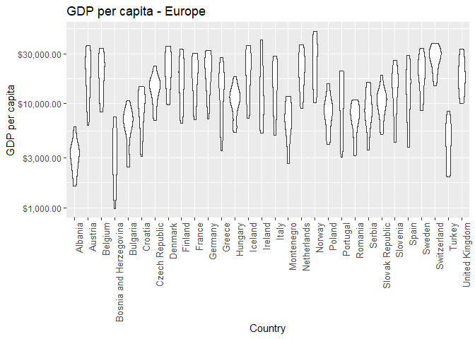
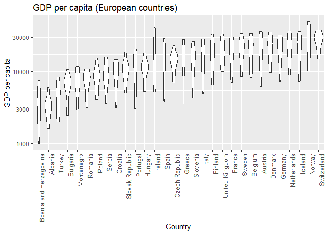
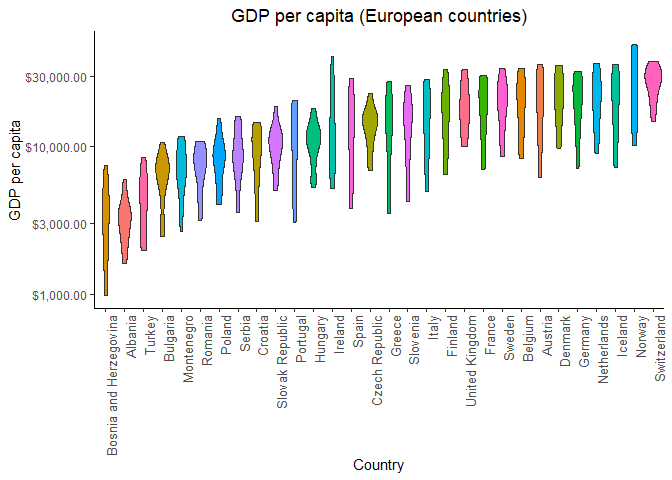

hw05-gapminder
================

Factor and figure management
============================

Initialize the data
-------------------

-   Load the required libraries:

``` r
suppressPackageStartupMessages(library(tidyverse))
suppressPackageStartupMessages(library(gapminder))
suppressPackageStartupMessages(library(knitr))
suppressPackageStartupMessages(library(plotly))
suppressPackageStartupMessages(library(scales))
```

-   We'll use *forcats* to help re-order factors (package located inside the tidyverse) and *plotly* to enhance the plot visualization
-   We will check the structure of the data first to *sanity check* that we are working with factors:

``` r
gapminder %>% str()
```

    ## Classes 'tbl_df', 'tbl' and 'data.frame':    1704 obs. of  6 variables:
    ##  $ country  : Factor w/ 142 levels "Afghanistan",..: 1 1 1 1 1 1 1 1 1 1 ...
    ##  $ continent: Factor w/ 5 levels "Africa","Americas",..: 3 3 3 3 3 3 3 3 3 3 ...
    ##  $ year     : int  1952 1957 1962 1967 1972 1977 1982 1987 1992 1997 ...
    ##  $ lifeExp  : num  28.8 30.3 32 34 36.1 ...
    ##  $ pop      : int  8425333 9240934 10267083 11537966 13079460 14880372 12881816 13867957 16317921 22227415 ...
    ##  $ gdpPercap: num  779 821 853 836 740 ...

-   We've confirmed that *country* is a factor with 142 levels and *continent* is a factor with 5 levels. We'll proceed with manipulating these factors

Part 1 - Factor Management
--------------------------

### Method

-   Drop Oceania by filtering the data to remove observations
-   Remove unused factor levels
-   Provide concrete information on the data before/after the manipulation
-   Re-order the levels of continent

### Code

First, we will examine a summary of the initial data:

``` r
gapminder %>% 
  summary() %>% #Evaluate the factors and observations per factor
  kable() #Enhance the table output
```

|     |     country     |   continent  |     year     |    lifeExp    |        pop        |    gdpPercap    |
|-----|:---------------:|:------------:|:------------:|:-------------:|:-----------------:|:---------------:|
|     | Afghanistan: 12 |  Africa :624 |  Min. :1952  |  Min. :23.60  |  Min. :6.001e+04  |   Min. : 241.2  |
|     |   Albania : 12  | Americas:300 | 1st Qu.:1966 | 1st Qu.:48.20 | 1st Qu.:2.794e+06 | 1st Qu.: 1202.1 |
|     |   Algeria : 12  |   Asia :396  | Median :1980 | Median :60.71 | Median :7.024e+06 | Median : 3531.8 |
|     |   Angola : 12   |  Europe :360 |  Mean :1980  |  Mean :59.47  |  Mean :2.960e+07  |  Mean : 7215.3  |
|     |  Argentina : 12 | Oceania : 24 | 3rd Qu.:1993 | 3rd Qu.:70.85 | 3rd Qu.:1.959e+07 | 3rd Qu.: 9325.5 |
|     |  Australia : 12 |      NA      |  Max. :2007  |  Max. :82.60  |  Max. :1.319e+09  |  Max. :113523.1 |
|     |  (Other) :1632  |      NA      |      NA      |       NA      |         NA        |        NA       |

Oceania has 24 observations in the original data set. Next we will drop the observations related to Oceania from the data set:

``` r
gapminder_dropOc <- gapminder %>%
  filter(continent != "Oceania") 

gapminder_dropOc %>% 
  summary() %>%  
  kable() 
```

|     |     country     |   continent  |     year     |    lifeExp    |        pop        |    gdpPercap    |
|-----|:---------------:|:------------:|:------------:|:-------------:|:-----------------:|:---------------:|
|     | Afghanistan: 12 |  Africa :624 |  Min. :1952  |  Min. :23.60  |  Min. :6.001e+04  |   Min. : 241.2  |
|     |   Albania : 12  | Americas:300 | 1st Qu.:1966 | 1st Qu.:48.08 | 1st Qu.:2.780e+06 | 1st Qu.: 1189.1 |
|     |   Algeria : 12  |   Asia :396  | Median :1980 | Median :60.34 | Median :7.024e+06 | Median : 3449.5 |
|     |   Angola : 12   |  Europe :360 |  Mean :1980  |  Mean :59.26  |  Mean :2.990e+07  |  Mean : 7052.4  |
|     |  Argentina : 12 |  Oceania : 0 | 3rd Qu.:1993 | 3rd Qu.:70.75 | 3rd Qu.:1.987e+07 | 3rd Qu.: 8943.2 |
|     |   Austria : 12  |      NA      |  Max. :2007  |  Max. :82.60  |  Max. :1.319e+09  |  Max. :113523.1 |
|     |  (Other) :1608  |      NA      |      NA      |       NA      |         NA        |        NA       |

``` r
gapminder_dropOc %>% 
  str()
```

    ## Classes 'tbl_df', 'tbl' and 'data.frame':    1680 obs. of  6 variables:
    ##  $ country  : Factor w/ 142 levels "Afghanistan",..: 1 1 1 1 1 1 1 1 1 1 ...
    ##  $ continent: Factor w/ 5 levels "Africa","Americas",..: 3 3 3 3 3 3 3 3 3 3 ...
    ##  $ year     : int  1952 1957 1962 1967 1972 1977 1982 1987 1992 1997 ...
    ##  $ lifeExp  : num  28.8 30.3 32 34 36.1 ...
    ##  $ pop      : int  8425333 9240934 10267083 11537966 13079460 14880372 12881816 13867957 16317921 22227415 ...
    ##  $ gdpPercap: num  779 821 853 836 740 ...

Oceania now has 0 observations, however it is still present in the data frame as a factor. Next, we will drop Oceania as an unused factor using the *droplevels()* function from the *forcats* package:

``` r
gapminder_dropOc <- gapminder_dropOc %>%
  droplevels()

gapminder_dropOc %>% 
  summary() %>% 
  kable()     
```

|     |     country     |   continent  |     year     |    lifeExp    |        pop        |    gdpPercap    |
|-----|:---------------:|:------------:|:------------:|:-------------:|:-----------------:|:---------------:|
|     | Afghanistan: 12 |  Africa :624 |  Min. :1952  |  Min. :23.60  |  Min. :6.001e+04  |   Min. : 241.2  |
|     |   Albania : 12  | Americas:300 | 1st Qu.:1966 | 1st Qu.:48.08 | 1st Qu.:2.780e+06 | 1st Qu.: 1189.1 |
|     |   Algeria : 12  |   Asia :396  | Median :1980 | Median :60.34 | Median :7.024e+06 | Median : 3449.5 |
|     |   Angola : 12   |  Europe :360 |  Mean :1980  |  Mean :59.26  |  Mean :2.990e+07  |  Mean : 7052.4  |
|     |  Argentina : 12 |      NA      | 3rd Qu.:1993 | 3rd Qu.:70.75 | 3rd Qu.:1.987e+07 | 3rd Qu.: 8943.2 |
|     |   Austria : 12  |      NA      |  Max. :2007  |  Max. :82.60  |  Max. :1.319e+09  |  Max. :113523.1 |
|     |  (Other) :1608  |      NA      |      NA      |       NA      |         NA        |        NA       |

``` r
gapminder_dropOc %>% 
  str()
```

    ## Classes 'tbl_df', 'tbl' and 'data.frame':    1680 obs. of  6 variables:
    ##  $ country  : Factor w/ 140 levels "Afghanistan",..: 1 1 1 1 1 1 1 1 1 1 ...
    ##  $ continent: Factor w/ 4 levels "Africa","Americas",..: 3 3 3 3 3 3 3 3 3 3 ...
    ##  $ year     : int  1952 1957 1962 1967 1972 1977 1982 1987 1992 1997 ...
    ##  $ lifeExp  : num  28.8 30.3 32 34 36.1 ...
    ##  $ pop      : int  8425333 9240934 10267083 11537966 13079460 14880372 12881816 13867957 16317921 22227415 ...
    ##  $ gdpPercap: num  779 821 853 836 740 ...

Oceania has now disappeared from the continent list. Further, we see that the factor continent now has only 4 levels. The original data set had 1704 observations of 6 variables (i.e. 1704 rows and 6 columns), while the manipulated data set has 1680 observations of 6 variables. Therefore we observe a concrete reduction in the data set.

Also, when manipulating a data set through filters, it is advantageous to create a new variable for the manipulated data in order to refer to it in the future and maintain the integrity of the original data set.

Next we will create a principled summary of the data based on the quantitative variable *gdpPercap*. We want to evaluate the rank of countries in Europe based on *gdpPercap*. We will start by evaluating the data as is, by observing the structure, a table and a plot:

``` r
Europe_gdp <- gapminder %>% 
  select(continent, country, gdpPercap,year) %>%  #Reduce the size of the data set for faster processing
  filter(continent == "Europe") 

Europe_gdp %>% 
  str()
```

    ## Classes 'tbl_df', 'tbl' and 'data.frame':    360 obs. of  4 variables:
    ##  $ continent: Factor w/ 5 levels "Africa","Americas",..: 4 4 4 4 4 4 4 4 4 4 ...
    ##  $ country  : Factor w/ 142 levels "Afghanistan",..: 2 2 2 2 2 2 2 2 2 2 ...
    ##  $ gdpPercap: num  1601 1942 2313 2760 3313 ...
    ##  $ year     : int  1952 1957 1962 1967 1972 1977 1982 1987 1992 1997 ...

The structure shows that we have 360 rows and 4 columns of data. All levels are currently present for all factors.

``` r
Europe_gdp %>% 
  ggplot(aes(country, gdpPercap)) + 
  geom_violin() +
  labs(title = "GDP per capita - Europe",
    x = "Country", y = "GDP per capita") +
  scale_y_log10(labels=dollar_format()) +
  theme(axis.text.x = element_text(angle = 90, hjust = 1, size = 10))  #Rotate x labels
```



The plot doesn't provide any insight into the rank of countries with respect to *gdpPercap* in it's current state. We will next *arrange* by *gdpPerCap* to see whether this has an effect on the table and plot:

``` r
Europe_gdp_arr <- Europe_gdp %>% 
  arrange(gdpPercap)

Europe_gdp_arr %>% 
  str()
```

    ## Classes 'tbl_df', 'tbl' and 'data.frame':    360 obs. of  4 variables:
    ##  $ continent: Factor w/ 5 levels "Africa","Americas",..: 4 4 4 4 4 4 4 4 4 4 ...
    ##  $ country  : Factor w/ 142 levels "Afghanistan",..: 13 13 2 13 2 132 13 132 2 132 ...
    ##  $ gdpPercap: num  974 1354 1601 1710 1942 ...
    ##  $ year     : int  1952 1957 1952 1962 1957 1952 1967 1957 1962 1962 ...

The structure was not affected by *arrange*.

``` r
Europe_gdp_head <- Europe_gdp %>% 
  head() %>% 
  kable() %>% 
  print()
```

    ## 
    ## 
    ## continent   country    gdpPercap   year
    ## ----------  --------  ----------  -----
    ## Europe      Albania     1601.056   1952
    ## Europe      Albania     1942.284   1957
    ## Europe      Albania     2312.889   1962
    ## Europe      Albania     2760.197   1967
    ## Europe      Albania     3313.422   1972
    ## Europe      Albania     3533.004   1977

``` r
Europe_gdp_arr_head <- Europe_gdp_arr %>% 
  head() %>% 
  kable() %>% 
  print()
```

    ## 
    ## 
    ## continent   country                   gdpPercap   year
    ## ----------  -----------------------  ----------  -----
    ## Europe      Bosnia and Herzegovina     973.5332   1952
    ## Europe      Bosnia and Herzegovina    1353.9892   1957
    ## Europe      Albania                   1601.0561   1952
    ## Europe      Bosnia and Herzegovina    1709.6837   1962
    ## Europe      Albania                   1942.2842   1957
    ## Europe      Turkey                    1969.1010   1952

``` r
Europe_gdp_arr %>% 
  ggplot(aes(country, gdpPercap)) + 
  geom_violin() +
  labs(title = "GDP per capita - Europe",
    x = "Country", y = "GDP per capita") +
  scale_y_log10(labels=dollar_format()) +
  theme(axis.text.x = element_text(angle = 90, hjust = 1, size = 10))  #Rotate x labels
```


The tables are useful for capturing exact values from the data. We can observe the difference between the "as is" data versus the arranged data. Therefore, the *arrange* functions did not affect the structure or the plot, however the table output is clearly different. Next we will evaluate the effect of using the *forcats* package to re-order the data:

``` r
Europe_gdp %>% 
  ggplot(aes(fct_reorder(country, gdpPercap), gdpPercap)) + 
  geom_violin() +
  labs(title = "GDP per capita - Europe",
    x = "Country", y = "GDP per capita") +
  scale_y_log10(labels=dollar_format()) +
  theme(axis.text.x = element_text(angle = 90, hjust = 1, size = 10))  #Rotate x labels
```


We observe that *fct\_reorder* does affect the plot, as it now shows countries in order of ascending median GDP per capita. Lastly, we will examine the effect of combining *arrange* and *fct\_reorder*:

``` r
Europe_gdp_arr %>% 
  ggplot(aes(fct_reorder(country, gdpPercap), gdpPercap)) + 
  geom_violin() +
  labs(title = "GDP per capita - Europe",
    x = "Country", y = "GDP per capita") +
  scale_y_log10(labels=dollar_format()) +
  theme(axis.text.x = element_text(angle = 90, hjust = 1, size = 10))  #Rotate x labels
```


Using the arranged data inside the re-ordered plot gave the same result as using the regular data with the re-ordered plot. However, we also know that *arrange* affects the table output. Thus, coupling *arrange* and *fct\_reorder* allows us to manipulate the table and plot, so it is more comprehensive to use both commands if both types of output are desired.

Part 2 - File I/O
-----------------

### Method

-   Create a new data set
-   Arrange the data set
-   Write to file
-   Read from file
-   Check the arrangement of the data

### Code

First, we will examine a sample of the data "as is". Then, we will *arrange* the data according to mean GDP per capita and compare:

``` r
gapminder_lifeExp <- gapminder %>% 
  select(lifeExp, continent, year) %>% 
  group_by(continent, year) %>% 
  summarise(mean_gdp = mean(lifeExp))

gapminder_lifeExp %>% 
  head() %>% 
  kable() %>% 
  print()
```

    ## 
    ## 
    ## continent    year   mean_gdp
    ## ----------  -----  ---------
    ## Africa       1952   39.13550
    ## Africa       1957   41.26635
    ## Africa       1962   43.31944
    ## Africa       1967   45.33454
    ## Africa       1972   47.45094
    ## Africa       1977   49.58042

``` r
gapminder_lifeExp_arr <- gapminder_lifeExp %>% 
  arrange(mean_gdp)

gapminder_lifeExp_arr %>% 
  head() %>% 
  kable() %>% 
  print()
```

    ## 
    ## 
    ## continent    year   mean_gdp
    ## ----------  -----  ---------
    ## Africa       1952   39.13550
    ## Africa       1957   41.26635
    ## Africa       1962   43.31944
    ## Africa       1967   45.33454
    ## Asia         1952   46.31439
    ## Africa       1972   47.45094

We observe the difference in values between the original data and the arranged data and will use these tables to determine whether the *csv* file preserves the arrangement or reverts to the original order:

``` r
write_csv(gapminder_lifeExp_arr, "gapminder_lifeExp_arr.csv")

read_csv("gapminder_lifeExp_arr.csv") %>% 
  kable()
```

    ## Parsed with column specification:
    ## cols(
    ##   continent = col_character(),
    ##   year = col_integer(),
    ##   mean_gdp = col_double()
    ## )

| continent |  year|  mean\_gdp|
|:----------|-----:|----------:|
| Africa    |  1952|   39.13550|
| Africa    |  1957|   41.26635|
| Africa    |  1962|   43.31944|
| Africa    |  1967|   45.33454|
| Asia      |  1952|   46.31439|
| Africa    |  1972|   47.45094|
| Asia      |  1957|   49.31854|
| Africa    |  1977|   49.58042|
| Asia      |  1962|   51.56322|
| Africa    |  1982|   51.59287|
| Americas  |  1952|   53.27984|
| Africa    |  2002|   53.32523|
| Africa    |  1987|   53.34479|
| Africa    |  1997|   53.59827|
| Africa    |  1992|   53.62958|
| Asia      |  1967|   54.66364|
| Africa    |  2007|   54.80604|
| Americas  |  1957|   55.96028|
| Asia      |  1972|   57.31927|
| Americas  |  1962|   58.39876|
| Asia      |  1977|   59.61056|
| Americas  |  1967|   60.41092|
| Americas  |  1972|   62.39492|
| Asia      |  1982|   62.61794|
| Americas  |  1977|   64.39156|
| Europe    |  1952|   64.40850|
| Asia      |  1987|   64.85118|
| Americas  |  1982|   66.22884|
| Asia      |  1992|   66.53721|
| Europe    |  1957|   66.70307|
| Asia      |  1997|   68.02052|
| Americas  |  1987|   68.09072|
| Europe    |  1962|   68.53923|
| Asia      |  2002|   69.23388|
| Oceania   |  1952|   69.25500|
| Americas  |  1992|   69.56836|
| Europe    |  1967|   69.73760|
| Oceania   |  1957|   70.29500|
| Asia      |  2007|   70.72848|
| Europe    |  1972|   70.77503|
| Oceania   |  1962|   71.08500|
| Americas  |  1997|   71.15048|
| Oceania   |  1967|   71.31000|
| Oceania   |  1972|   71.91000|
| Europe    |  1977|   71.93777|
| Americas  |  2002|   72.42204|
| Europe    |  1982|   72.80640|
| Oceania   |  1977|   72.85500|
| Americas  |  2007|   73.60812|
| Europe    |  1987|   73.64217|
| Oceania   |  1982|   74.29000|
| Europe    |  1992|   74.44010|
| Oceania   |  1987|   75.32000|
| Europe    |  1997|   75.50517|
| Europe    |  2002|   76.70060|
| Oceania   |  1992|   76.94500|
| Europe    |  2007|   77.64860|
| Oceania   |  1997|   78.19000|
| Oceania   |  2002|   79.74000|
| Oceania   |  2007|   80.71950|

The new table matches the arranged data table shown previously. Therefore, we learned that *arrange* can be used to manipulate tables that are written externally to files. This is a powerful technique for manipulating data, as it is much more convinient to sort data using R than to sort it manually in a *csv*.

Part 3 - Visualization Design
-----------------------------

Next I will improve the plot from Part 1 by using visualization design techniques to enhance the appearance and readability. As a reminder, my first plot looked like this:

``` r
Europe_gdp_arr %>% 
  ggplot(aes(fct_reorder(country, gdpPercap), gdpPercap)) + 
  geom_violin() +
  labs(title = "GDP per capita (European countries)",
    x = "Country", y = "GDP per capita") +
  scale_y_log10() +
  theme(axis.text.x = element_text(angle = 90, hjust = 1, size = 10))  #Rotate x labels
```



I will apply a few different techniques from class to improve the plot visually: \* Changing the scale to *dollar\_format()* \* Using the *black & white* theme \* Eliminating the unnecessary borders on the top and right side of the plot \* Centering the title \* Applying a continuous colour scheme to visually separate the countries by colour \* Removing the legend that is generated from applying the colour scheme

``` r
Europe_gdp_plot <- Europe_gdp_arr %>% 
  ggplot(aes(fct_reorder(country, gdpPercap), gdpPercap, fill = country), alpha = 0.2) + 
  geom_violin() +
  labs(title = "GDP per capita (European countries)",
    x = "Country", y = "GDP per capita") +
  scale_y_log10(labels=dollar_format()) +
  theme_bw() +
  theme(panel.border = element_blank(), 
        panel.grid.major = element_blank(),
        panel.grid.minor = element_blank(), 
       axis.line = element_line(colour = "black")) +
  theme(plot.title = element_text(hjust = 0.5)) +
  guides(fill = FALSE) +
  theme(axis.text.x = element_text(angle = 90, hjust = 1, size = 10))

Europe_gdp_plot
```



Overall, I believe that the plot is visually easier to read and more appealing to the viewer, due to the removal of unnecessary features and the addition of colour to separate the countries.

Next, we will convert this plot into a *plotly* plot using the porting function in *ggplotly*:

``` r
#Europe_gdp_plot %>% 
 # ggplotly()
```

To reduce the file size in Github, the output image can be viewed .

The biggest advantage that I can glean from using *plotly* is the ability to read data point values using the cursor. By mousing over any location on the graph, it is possible to see the exact (x,y) coordinates. The conversion also added the legend back in, but the rest of the formatting was preserved. The overal aesthetic is slightly cleaner and crisper than the \*\*ggplot\* plot. I believe this is due to the change in font and crisper borders.

*Plotly* can also be used to create 3D plots and HTML widgets, which can't be done in ggplot:

``` r
#plot_ly(
 # Europe_gdp_arr, 
  #x = ~country, 
  #y = ~gdpPercap, 
  #z = ~year,
  #type = "scatter3d",
  #mode = "markers",
  #opacity = 0.5
  #) #%>% 
  #htmlwidgets::saveWidget("plotly.html"
```

To reduce the file size in Github, the output image can be viewed .

*Plotly* opens us many possibilities for making data more interactive. It allows plots to be easily embedded on webpages and allows you to explore many new visualizations options that can help to reveal correlations in the data.

Part 4 - Writing figures to file
--------------------------------

Finally, we will save the plot as a *png* image:

``` r
ggsave("Europe_gdp_plot.png", plot = Europe_gdp_plot, width = 18, height = 8, units = "cm")
```

The plot image is located 

Resources
---------

<http://felixfan.github.io/ggplot2-remove-grid-background-margin/> <https://stackoverflow.com/questions/40675778/center-plot-title-in-ggplot2>
