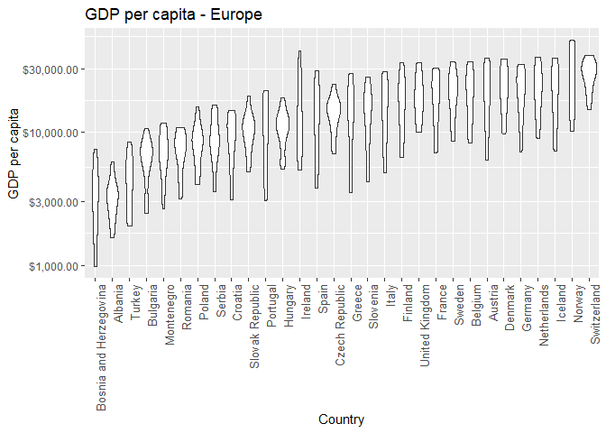

hw05-gapminder
================

Factor and figure management
============================

Initialize the data
-------------------

-   Load the required libraries:

``` r
suppressPackageStartupMessages(library(tidyverse))
suppressPackageStartupMessages(library(gapminder))
suppressPackageStartupMessages(library(knitr))
suppressPackageStartupMessages(library(plotly))
suppressPackageStartupMessages(library(broom))
suppressPackageStartupMessages(library(scales))
```

-   We'll use *forcats* to help re-order factors (package located inside the tidyverse) and *plotly* to enhance the plot visualization. *Broom* is handy for providing statistical analyses.
-   We will check the structure of the data first to *sanity check* that we are working with factors:

``` r
gapminder %>% str()
```

    ## Classes 'tbl_df', 'tbl' and 'data.frame':    1704 obs. of  6 variables:
    ##  $ country  : Factor w/ 142 levels "Afghanistan",..: 1 1 1 1 1 1 1 1 1 1 ...
    ##  $ continent: Factor w/ 5 levels "Africa","Americas",..: 3 3 3 3 3 3 3 3 3 3 ...
    ##  $ year     : int  1952 1957 1962 1967 1972 1977 1982 1987 1992 1997 ...
    ##  $ lifeExp  : num  28.8 30.3 32 34 36.1 ...
    ##  $ pop      : int  8425333 9240934 10267083 11537966 13079460 14880372 12881816 13867957 16317921 22227415 ...
    ##  $ gdpPercap: num  779 821 853 836 740 ...

-   We've confirmed that *country* is a factor with 142 levels and *continent* is a factor with 5 levels. We'll proceed with manipulating the data.

Part 1 - Factor Management
--------------------------

*Characterize data before and after re-levelling*

Drop Oceania. Filter the Gapminder data to remove observations associated with the continent of Oceania. Additionally, remove unused factor levels. Provide concrete information on the data before and after removing these rows and Oceania; address the number of rows and the levels of the affected factors.

Reorder the levels of country or continent. Use the forcats package to change the order of the factor levels, based on a principled summary of one of the quantitative variables. Consider experimenting with a summary statistic beyond the most basic choice of the median.

### Method

-   Drop Oceania by filtering the data to remove observations
-   Remove unused factor levels
-   Provide concrete information on the data before/after the manipulation (e.g. effect on number of rows/levels of affected factors)
-   Re-order the levels of continent: use forcats to change the order of the factor levels based on a principled summary of one of the quantitative variables (consider something other than median)

### Code

First, we will examine a summary of the initial data:

``` r
gapminder %>% 
  summary() %>% #Evaluate the factors and observations per factor
  kable() #Enhance the table output
```

|     |     country     |   continent  |     year     |    lifeExp    |        pop        |    gdpPercap    |
|-----|:---------------:|:------------:|:------------:|:-------------:|:-----------------:|:---------------:|
|     | Afghanistan: 12 |  Africa :624 |  Min. :1952  |  Min. :23.60  |  Min. :6.001e+04  |   Min. : 241.2  |
|     |   Albania : 12  | Americas:300 | 1st Qu.:1966 | 1st Qu.:48.20 | 1st Qu.:2.794e+06 | 1st Qu.: 1202.1 |
|     |   Algeria : 12  |   Asia :396  | Median :1980 | Median :60.71 | Median :7.024e+06 | Median : 3531.8 |
|     |   Angola : 12   |  Europe :360 |  Mean :1980  |  Mean :59.47  |  Mean :2.960e+07  |  Mean : 7215.3  |
|     |  Argentina : 12 | Oceania : 24 | 3rd Qu.:1993 | 3rd Qu.:70.85 | 3rd Qu.:1.959e+07 | 3rd Qu.: 9325.5 |
|     |  Australia : 12 |      NA      |  Max. :2007  |  Max. :82.60  |  Max. :1.319e+09  |  Max. :113523.1 |
|     |  (Other) :1632  |      NA      |      NA      |       NA      |         NA        |        NA       |

Oceania has 24 observations in the original data set. Next we will drop the observations related to Oceania from the data set:

``` r
gapminder_dropOc <- gapminder %>%
  filter(continent != "Oceania") 

gapminder_dropOc %>% 
  summary() %>%  
  kable() 
```

|     |     country     |   continent  |     year     |    lifeExp    |        pop        |    gdpPercap    |
|-----|:---------------:|:------------:|:------------:|:-------------:|:-----------------:|:---------------:|
|     | Afghanistan: 12 |  Africa :624 |  Min. :1952  |  Min. :23.60  |  Min. :6.001e+04  |   Min. : 241.2  |
|     |   Albania : 12  | Americas:300 | 1st Qu.:1966 | 1st Qu.:48.08 | 1st Qu.:2.780e+06 | 1st Qu.: 1189.1 |
|     |   Algeria : 12  |   Asia :396  | Median :1980 | Median :60.34 | Median :7.024e+06 | Median : 3449.5 |
|     |   Angola : 12   |  Europe :360 |  Mean :1980  |  Mean :59.26  |  Mean :2.990e+07  |  Mean : 7052.4  |
|     |  Argentina : 12 |  Oceania : 0 | 3rd Qu.:1993 | 3rd Qu.:70.75 | 3rd Qu.:1.987e+07 | 3rd Qu.: 8943.2 |
|     |   Austria : 12  |      NA      |  Max. :2007  |  Max. :82.60  |  Max. :1.319e+09  |  Max. :113523.1 |
|     |  (Other) :1608  |      NA      |      NA      |       NA      |         NA        |        NA       |

``` r
gapminder_dropOc %>% 
  str()
```

    ## Classes 'tbl_df', 'tbl' and 'data.frame':    1680 obs. of  6 variables:
    ##  $ country  : Factor w/ 142 levels "Afghanistan",..: 1 1 1 1 1 1 1 1 1 1 ...
    ##  $ continent: Factor w/ 5 levels "Africa","Americas",..: 3 3 3 3 3 3 3 3 3 3 ...
    ##  $ year     : int  1952 1957 1962 1967 1972 1977 1982 1987 1992 1997 ...
    ##  $ lifeExp  : num  28.8 30.3 32 34 36.1 ...
    ##  $ pop      : int  8425333 9240934 10267083 11537966 13079460 14880372 12881816 13867957 16317921 22227415 ...
    ##  $ gdpPercap: num  779 821 853 836 740 ...

Oceania now has 0 observations, however it is still present in the data frame as a factor. Next, we will drop Oceania as an unused factor using the *droplevels()* function from the *forcats* package:

``` r
gapminder_dropOc <- gapminder_dropOc %>%
  droplevels()

gapminder_dropOc %>% 
  summary() %>% 
  kable()     
```

|     |     country     |   continent  |     year     |    lifeExp    |        pop        |    gdpPercap    |
|-----|:---------------:|:------------:|:------------:|:-------------:|:-----------------:|:---------------:|
|     | Afghanistan: 12 |  Africa :624 |  Min. :1952  |  Min. :23.60  |  Min. :6.001e+04  |   Min. : 241.2  |
|     |   Albania : 12  | Americas:300 | 1st Qu.:1966 | 1st Qu.:48.08 | 1st Qu.:2.780e+06 | 1st Qu.: 1189.1 |
|     |   Algeria : 12  |   Asia :396  | Median :1980 | Median :60.34 | Median :7.024e+06 | Median : 3449.5 |
|     |   Angola : 12   |  Europe :360 |  Mean :1980  |  Mean :59.26  |  Mean :2.990e+07  |  Mean : 7052.4  |
|     |  Argentina : 12 |      NA      | 3rd Qu.:1993 | 3rd Qu.:70.75 | 3rd Qu.:1.987e+07 | 3rd Qu.: 8943.2 |
|     |   Austria : 12  |      NA      |  Max. :2007  |  Max. :82.60  |  Max. :1.319e+09  |  Max. :113523.1 |
|     |  (Other) :1608  |      NA      |      NA      |       NA      |         NA        |        NA       |

``` r
gapminder_dropOc %>% 
  str()
```

    ## Classes 'tbl_df', 'tbl' and 'data.frame':    1680 obs. of  6 variables:
    ##  $ country  : Factor w/ 140 levels "Afghanistan",..: 1 1 1 1 1 1 1 1 1 1 ...
    ##  $ continent: Factor w/ 4 levels "Africa","Americas",..: 3 3 3 3 3 3 3 3 3 3 ...
    ##  $ year     : int  1952 1957 1962 1967 1972 1977 1982 1987 1992 1997 ...
    ##  $ lifeExp  : num  28.8 30.3 32 34 36.1 ...
    ##  $ pop      : int  8425333 9240934 10267083 11537966 13079460 14880372 12881816 13867957 16317921 22227415 ...
    ##  $ gdpPercap: num  779 821 853 836 740 ...

We observe that Oceania has now disappeared from the continent list. Further, we see that the factor continent now has only 4 levels. The original data set had 1704 observations of 6 variables (i.e. 1704 rows and 6 columns), while the manipulated data set has 1680 observations of 6 variables. Therefore we observe a concrete reduction on the data. When manipulating a data set through filters, it is advantageous to create a new variable for the manipulated data in order to refer to it in the future and maintain the integrity of the original data set.

-   Next we will create a principled summary of the data based on the quantitative variable *gdpPercap*. We want to evaluate the rank of countries in Europe based on gdpPercap. We will start by plotting the data as is:

``` r
Europe_gdp <- gapminder %>% 
  select(continent, country, gdpPercap,year) %>%  #Reduce the size of the data set for faster processing
  filter(continent == "Europe") 

Europe_gdp %>% 
  str()
```

    ## Classes 'tbl_df', 'tbl' and 'data.frame':    360 obs. of  4 variables:
    ##  $ continent: Factor w/ 5 levels "Africa","Americas",..: 4 4 4 4 4 4 4 4 4 4 ...
    ##  $ country  : Factor w/ 142 levels "Afghanistan",..: 2 2 2 2 2 2 2 2 2 2 ...
    ##  $ gdpPercap: num  1601 1942 2313 2760 3313 ...
    ##  $ year     : int  1952 1957 1962 1967 1972 1977 1982 1987 1992 1997 ...

``` r
Europe_gdp %>% 
  head() %>% 
  kable()
```

| continent | country |  gdpPercap|  year|
|:----------|:--------|----------:|-----:|
| Europe    | Albania |   1601.056|  1952|
| Europe    | Albania |   1942.284|  1957|
| Europe    | Albania |   2312.889|  1962|
| Europe    | Albania |   2760.197|  1967|
| Europe    | Albania |   3313.422|  1972|
| Europe    | Albania |   3533.004|  1977|

``` r
Europe_gdp %>% 
  ggplot(aes(country, gdpPercap)) + 
  geom_point() +
  labs(title = "GDP per capita - Europe",
    x = "Country", y = "GDP per capita") +
  scale_y_log10(labels=dollar_format()) +
  #scale_x_log10(labels=comma_format()) + #Apply the scale package to suit the scale to the values
  theme_bw() +
  theme(axis.text.x = element_text(angle = 90, hjust = 1, size = 10))  #Rotate x labels
```


Plotting the data directly doesn't provide any insight into a correlation between these two variables. We will next *arrange* by gdpPerCap to see whether this has an effect on the table and plot:

``` r
Europe_gdp_arr <- Europe_gdp %>% 
  arrange(gdpPercap)

Europe_gdp_arr %>% 
  str()
```

    ## Classes 'tbl_df', 'tbl' and 'data.frame':    360 obs. of  4 variables:
    ##  $ continent: Factor w/ 5 levels "Africa","Americas",..: 4 4 4 4 4 4 4 4 4 4 ...
    ##  $ country  : Factor w/ 142 levels "Afghanistan",..: 13 13 2 13 2 132 13 132 2 132 ...
    ##  $ gdpPercap: num  974 1354 1601 1710 1942 ...
    ##  $ year     : int  1952 1957 1952 1962 1957 1952 1967 1957 1962 1962 ...

``` r
Europe_gdp_arr %>% 
  head() %>% 
  kable()
```

| continent | country                |  gdpPercap|  year|
|:----------|:-----------------------|----------:|-----:|
| Europe    | Bosnia and Herzegovina |   973.5332|  1952|
| Europe    | Bosnia and Herzegovina |  1353.9892|  1957|
| Europe    | Albania                |  1601.0561|  1952|
| Europe    | Bosnia and Herzegovina |  1709.6837|  1962|
| Europe    | Albania                |  1942.2842|  1957|
| Europe    | Turkey                 |  1969.1010|  1952|

``` r
Europe_gdp_arr %>% 
  ggplot(aes(country, gdpPercap)) + 
  geom_point() +
  labs(title = "GDP per capita - Europe",
    x = "Country", y = "GDP per capita") +
  scale_y_log10(labels=dollar_format()) +
  #scale_x_log10(labels=comma_format()) + #Apply the scale package to suit the scale to the values
  theme_bw() +
  theme(axis.text.x = element_text(angle = 90, hjust = 1, size = 10))  #Rotate x labels
```


We observe the *arrange* did not affect the structure or the plot, however the table output is clearly different. Next we will evaluate the effect of using the *forcats* package to re-order the data:

``` r
Europe_gdp %>% 
  ggplot(aes(fct_reorder(country, gdpPercap), gdpPercap)) + 
  geom_point() +
  labs(title = "GDP per capita - Europe",
    x = "Country", y = "GDP per capita") +
  scale_y_log10(labels=dollar_format()) +
  #scale_x_log10(labels=comma_format()) + #Apply the scale package to suit the scale to the values
  theme_bw() +
  theme(axis.text.x = element_text(angle = 90, hjust = 1, size = 10))  #Rotate x labels
```



We observe that *fct\_reorder* does affect the plot, as it now shows countries in order of ascending median GDP per capita. Finally, we will examine the effect of combining *arrange* and *fct\_reorder*:

``` r
Europe_gdp_arr %>% 
  ggplot(aes(fct_reorder(country, gdpPercap), gdpPercap)) + 
  geom_point() +
  labs(title = "GDP per capita - Europe",
    x = "Country", y = "GDP per capita") +
  scale_y_log10(labels=dollar_format()) +
  #scale_x_log10(labels=comma_format()) + #Apply the scale package to suit the scale to the values
  theme_bw() +
  theme(axis.text.x = element_text(angle = 90, hjust = 1, size = 10))  #Rotate x labels
```


Thus, coupling *arrange* and *fct\_reorder* allows us to manipulate the structure, table and plot, so it is more comprehensive to use both commands if all three types of output are desired.

Part 2 - File I/O
-----------------

Part 3 - Visualization Design
-----------------------------

Part 4 - Writing figures to file
--------------------------------

Bonus - Re-evaluate a factor
----------------------------
